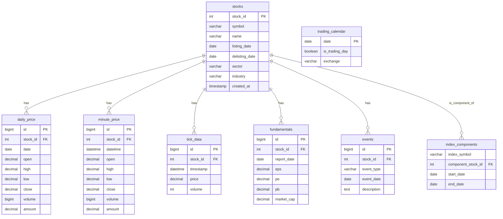

## 永久投资组合
前面提到过关于理财的事情，那个时候我第一次加仓，总共往里面投入了一千元左右。现在我自己很是折腾了一番，往里面投的钱达到了七千多，人们说学股票很简单，套牢之后慢慢看慢慢学，也就回了。我的情况也是这样，亏了一点前，便也学习接触到了不少观察方法，比如通过MA120和现价的价差判断技术上是否高估，比如通过PE等数字观察相对于基本面的高低估等。

然而，工科生自然就会问一个问题：这些朴素的观察，能否给出定量的分析？当然是可以的，接触量化的想法由此自然地萌芽了。量化的第一步，是先观察历史数据，更具体地来说，就是做回测。对于我来说，我设定了一个最简单的目标：回测可得的数据，以确定永久投资组合在中国市场下运用时，宽基指数和债券选取什么标的比较好。

## 技术路线
我希望用Tushare Pro给出的数据建立本地部署的历史数据库，每日更新，结合Python做量化策略回测。以上这些，原理上大致可以分为四步：

- 数据获取：通过Tushare Pro的API接口获取数据。
- 数据储存：通过数据库，将获取的数据储存在本地以减少重复获取，并增加处理速度。
- 数据更新：通过API更新增量数据，将最新交易日的数据同步过来。
- 数据回测：通过回测算法查询本地数据库的数据，并给出回测结果。

原理上的步骤已经分完，但是各个步骤的具体实现方法还有待接下来确定。具体实现步骤如下：

- 要使用Tushare Pro，需要首先建立相关的平台。根据官网指示，使用的前提是安装Python（推荐3.7）、安装Pandas、安装lxml。官网也显示，推荐安装Anaconda，说实话我不是很清楚Anaconda的作用，我一直都是直接安装Python配置环境变量使用，这一步我尽量能跳就跳。最后是安装tushare，同样通过pip来安装。
- 在安装完毕后，既然要调用API，就得获得相关的权限。根据官网的操作手册，需要先注册tushare的社区用户身份，最后获取token并妥善保管，这是调取数据的唯一凭证。
- 完成了注册tushare社区用户和获取tushare token凭证之后，就可以调取数据了，调取数据有两种方法：一种是使用多种语言的SDK调用数据，另一种是通过http调用。为了简单起见，我采用SDK调用的方法，而SDK调用支持Python、Matlab、R语言三种方法。考虑到我比较熟悉Python，我决定使用Python SDK调用数据。
- 用SDK调用数据之后，需要存储在本地的数据库里，数据库方面我几乎一无所知，因此询问了AI。根据DS给出的回答，数据库包括关系型数据库、时序数据库、NoSQL数据库三种，根据AI的介绍，我似乎更适合使用关系型数据库，AI推荐了PostgreSQL。
- PostgreSQL在Windows下可以直接下载交互式安装程序，安装完成后可以通过pgAdmin4进入图形化管理界面。关于PostgreSQL的文档，可以在以下网站查看：http://www.postgres.cn/docs/17/index.html，不过这个文档没有介绍pgAdmin的使用方式。
- PostgreSQL的架构从服务器开始，服务器下设数据库，数据库下设表，初步设计架构可以用mermaid ER图表示如下：

