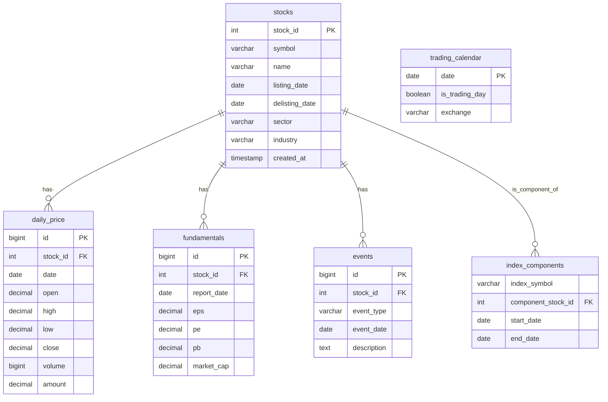

## 永久投资组合
前面提到过关于理财的事情，那个时候我第一次加仓，总共往里面投入了一千元左右。现在我自己很是折腾了一番，往里面投的钱达到了七千多，人们说学股票很简单，套牢之后慢慢看慢慢学，也就回了。我的情况也是这样，亏了一点前，便也学习接触到了不少观察方法，比如通过MA120和现价的价差判断技术上是否高估，比如通过PE等数字观察相对于基本面的高低估等。

然而，工科生自然就会问一个问题：这些朴素的观察，能否给出定量的分析？当然是可以的，接触量化的想法由此自然地萌芽了。量化的第一步，是先观察历史数据，更具体地来说，就是做回测。对于我来说，我设定了一个最简单的目标：回测可得的数据，以确定永久投资组合在中国市场下运用时，宽基指数和债券选取什么标的比较好。

## 技术路线
我希望用Tushare Pro给出的数据建立本地部署的历史数据库，每日更新，结合Python做量化策略回测。以上这些，原理上大致可以分为四步：

- 数据获取：通过Tushare Pro的API接口获取数据。
- 数据储存：通过数据库，将获取的数据储存在本地以减少重复获取，并增加处理速度。
- 数据更新：通过API更新增量数据，将最新交易日的数据同步过来。
- 数据回测：通过回测算法查询本地数据库的数据，并给出回测结果。

原理上的步骤已经分完，但是各个步骤的具体实现方法还有待接下来确定。从数据获取到数据储存，具体实现步骤如下：

- 要使用Tushare Pro，需要首先建立相关的平台。根据官网指示，使用的前提是安装Python（推荐3.7）、安装Pandas、安装lxml。官网也显示，推荐安装Anaconda，说实话我不是很清楚Anaconda的作用，我一直都是直接安装Python配置环境变量使用。最后是安装tushare，同样通过pip来安装。
- 在安装完毕后，既然要调用API，就得获得相关的权限。根据官网的操作手册，需要先注册tushare的社区用户身份，最后获取token并妥善保管，这是调取数据的唯一凭证。
- 完成了注册tushare社区用户和获取tushare token凭证之后，就可以调取数据了，调取数据有两种方法：一种是使用多种语言的SDK调用数据，另一种是通过http调用。为了简单起见，我采用SDK调用的方法，而SDK调用支持Python、Matlab、R语言三种方法。考虑到我比较熟悉Python，我决定使用Python SDK调用数据。
- 用SDK调用数据之后，需要存储在本地的数据库里，数据库方面我几乎一无所知，因此询问了AI。根据DS给出的回答，数据库包括关系型数据库、时序数据库、NoSQL数据库三种，根据AI的介绍，我似乎更适合使用关系型数据库，AI推荐了PostgreSQL。
- PostgreSQL在Windows下可以直接下载交互式安装程序，安装完成后可以通过pgAdmin4进入图形化管理界面。关于PostgreSQL的文档，可以在以下网站查看：http://www.postgres.cn/docs/17/index.html，不过这个文档没有介绍pgAdmin的使用方式。
- PostgreSQL的架构从服务器开始，服务器下设数据库，数据库下设表，初步设计架构可以用mermaid ER图表示如下：

其中，stocks是股票的基本信息，包括自主添加的股票内部标识stock_id、股票代码symbol、股票名称name、上市退市日期listing\delisting_date、板块sector、所属产业industry、记录创建时间timestamp。这是其他表的主表，通过id与其他数据关联，确保数据一致性。

以及参考数据相关表index_components，包括：
交易日历trading_calendar表，包括日期d·ate，是否为交易日的布尔值is_trading_day，交易所代码exchange，用于判断某一天是否交易，并对齐时间序列。
指数成分股表，用于查询某指数的成分股列表，包括成分股idcomponent_stock_id、指数代码index_symbol、股票纳入开始和结束日期start/end_date。

接着是行情数据相关表，AI建议给出日线、分钟线、tick的行情表，但考虑到我未来的工作性质和计算机算力水平，目前线引入日线行情表daily_price，包括自增主键id、股票ID-stock_id、交易日期date、开盘收盘价open/close、最高最低价high/low、成交量volume和成交金额amount。

随后是基本面数据表fundamentals，包括自增主键id、股票ID-stock_id、报告期report_date、每股收益eps、市盈率pe、市净率pb、总市值market_cap。

最后是事件数据表events，包括自增主键id，股票ID-stock_id、事件类型event_type、事件发生日期date、事件详细描述description。

目前对于基本的技术路线，已经比较清楚，我打算先开始尝试一下，接下来是执行日志。

## 执行日志

注册非常简单，使用自己的手机号接受验证码就注册完成了，token获取也非常简单，anaconda的下载和安装同步进行完成之后，就是配置Python3.7、安装pandas、lxml和tushare，在这个间隙里，我学习了一下anaconda的使用。

anaconda本质上就是一个用于配置python有关环境的容器。我在以往的开发中已经发现，python虽然开源，但是版本庞杂，不同的版本支持不同的包，而anaconda可以配置不同的环境，每一个环境有自己特定版本的python和对应的一套软件包。

对于我当前的项目需求而言，我只需要创建一个用于tushare的环境，我可以创建一个名为StocksTest的环境，这需要用到使用创建命令：
```python
conda create -n StocksTest python=3.7
conda activate StocksTest
```

不过，安装完毕后我发现其实anaconda在Windows下的操作十分傻瓜，只需要使用最简单的图形化操作，点击environment之后点击create就可以了。随后，我进入该环境，成功安装了pandas、tushare，安装tushare的同时，可能由于依赖关系，进度中也就自动开始安装lxml。

然而，不使用代理的情况下，安装lxml非常缓慢，而且超时失败。所以我挂上代理，先安装了lxml，随后取掉代理继续安装tushare，这是因为tushare和lxml相反，如果挂上代理就会直接安装失败。

此时我发现Tushare上的数据，相当一部分我是无权获取的，比如指数和ETF的数据，就连日线行情我都无权获取，ETF的获取所需权限则最高。而30年国债场内只有两个ETF，场外大概只有一个债券可以追踪其走势。我因而前往中证的官网去寻找，找到了xlsx形式的行情数据。

该行情数据包括日期Date、指数代码Index Code、指数中文全称Index Chinese Name(Full)、指数中文简称Index Chinese Name、指数英文全称Index English Name(Full)、指数英文简称Index English Name、开盘Open、最高High、最低Low、收盘Close、涨跌Change、涨跌幅(%)Change(%)、成交量（万手）Volume(M Shares)、成交金额（亿元）Turnover、样本数量ConsNumber这些数据，我目前能用到的行情数据大抵就是这些。

通过从中证指数下载，我拿到了中证A500、中证红利、中证30年国债指数的行情数据，其中中证A500和中证红利的数据都上溯至2004年12月31日，而30年国债指数则上溯至2010年12月31日。

至于黄金的行情数据，我目前无法找到有关的数据，我原打算到上海黄金交易所去爬数据，但是AI说借助akshare包可以直接找到爬取的数据。那么接下来就是安装akshare了。

akshare至少需要安装在3.8版本以上的python中，因此我做了隔离。随后我让AI帮我编写了从akshare中提取数据并存储于xlsx中的脚本。
